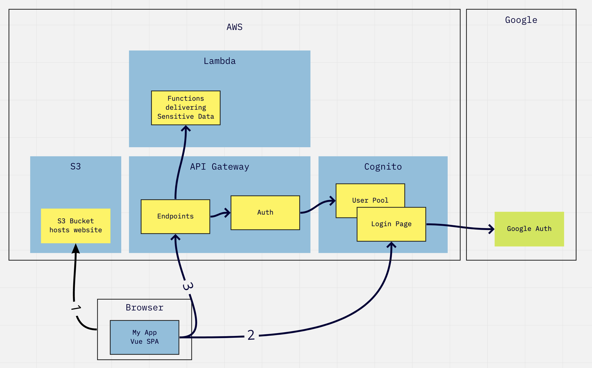

# spa-with-google-auth

An example of a Single Page App that uses Google Authentication.
Uses OAuth2 Authorization Code Grant with PKCE flow.

## Welcome!

### Run this app

After cloning or downloading this repository:

```shell
npm install
npm run serve
```

The App is using the more secure `Authorization Code Grant with PKCE` OAuth2 flow.
You can see the `Implicit Grant` flow by using the `HelloWorld.vue` component
instead of the `HelloWorldPkce.vue` component; change that in `App.vue`.

### What this example covers

- Hosts a web page that only my company colleagues can access
- My company uses Google accounts, so I use Google to authenticate users
- I don't want any signup or sign in, I don't want to manage any user accounts for my app,
  I just want to authenticate my colleagues
- I want to use a Single Page App (SPA), which means no web server, no backend,
  which means that anything private must be housed elsewhere
- I will use APIs to house the private content,
  only returning results to users who are authenticated to be my colleagues

### Known Issues

- My own Google Auth only authenticates members of @socotra.com,
  because it's easier to set up the Google Credentials to do so.
  To have it authenticate other Google accounts, you have to do more work.
  Thus my goal of only allowing @socotra.com folks in is achieved, but not
  through inspecting id_tokens.

- I do not do any local verification of the `ID Token`.
  I think this is ok because I am not trusting the token or any information it contains in my app.
  Instead, I send the token to my APIs that house the protected content. API Gateway is configured
  to check the token (via Cognito) before hitting the protected APIs. This seems sufficient.

### Authentication Architecture



1. Browser loads the SPA from an S3 Bucket.
   The SPA should not contain any sensitive data.
2. SPA redirects to the Cognito Login Page.
   The Cognito Login pages provides buttons, e.g. Login with Google, Login with Amazon, etc.
   After auth, via Google in this case, Cognito Login Page redirects to the SPA with an auth token.
3. SPA page is loaded again (due to the redirect in step 2),
   this time with an Auth token.
   The SPA uses the auth token when making a request to API Gateway endpoint.
   API Gateway passes that token to a configured Authorizer, which defers to the Cognito User Pool.
   The User Pool decides whether the token is valid.
   If so, API Gateway allows the request to go through to the Lambda Function,
   which provides the sensitive data.

## Recreate this project

### Create a new Vue project

Install or Update Vue CLI

```shell
npm update @vue/cli
```

Create a new project with Vue CLI

```shell
vue create spa-with-google-auth
```

Here are the options I chose:

```text
Vue CLI v4.5.10
? Please pick a preset: Manually select features
? Check the features needed for your project: Choose Vue version, Babel, Linter
? Choose a version of Vue.js that you want to start the project with 2.x
? Pick a linter / formatter config: Prettier
? Pick additional lint features: Lint on save
? Where do you prefer placing config for Babel, ESLint, etc.? In package.json
? Save this as a preset for future projects? (y/N)
```

Add Vuetify for nice buttons and things

```shell
vue add vuetify
```

### Create Google API Credentials

This will me to send Authentication requests to Google.
In my scenario AWS Cognito will be the one calling on Google.

Google Developer Console, API Credentials: https://console.developers.google.com/apis/credentials

`Create Credentials` button up top > `OAuth Client ID`
`Application Type` = `Web Application`
Give it a name, done.
Note the `App ID` and `App Secret`.

Note the section called `Authorized redirect URIs`.
The URIs you list here will need to match the URI that Cognito asks Google to redirect to.
(we'll get to that below).

### Create a Cognito User Pool

The Cognito User Pool is my Auth service. It will do most of the heavy lifting.

https://console.aws.amazon.com/cognito/users/#/pool/new/create
Default settings

#### Add Google as a Federated Identity provider

User Pool Settings > Federation > Identity Providers > Google

Input
`Google app ID`,
`App secret`, and
`Authorize scope` = `profile email openid`

Now go to User Pool Settings > Federation > Attribute Mapping > Google
Tick the Capture checkbox for Google attribute `email` and map it to User pool attribute `Email`

#### Add an App Client to the User Pool

This is a client that I will talk to from my SPA and that API Gateway will talk to,
in order to interact with my Cognito User Pool.

This app will also serve a hosted UI, which will be a very simple page with a button
that says "login with Google". You can do much more with it but that's my scenario.

User Pool Settings > General Settings > App Clients > Add an app client

Un-tick `Generate Client Secret`

Done, create it.

User Pool Settings > App Integration > App Client Settings
Tick to enable Google only (the only Auth mechanism I want to allow)
The Callback URL is where the user is directed after authenticating.
For now, to support development work, running my SPA locally:
`Callback URL` = `http://localhost:8081`

Sign out URL is ?? not yet sure.
`Sign out URL` = `http://localhost:8081`

I'm going to demonstrate using both `Implicit Grant` and `Authorization Code Grant with PKCE` OAuth flows,
so allow both of those. Note that `Implicit Grant` is NOT secure for SPAs. It can be used successfully in a scenario
where a web app has a backend that can handle sensitive auth data without exposing it to the front end. So, I will be
demonstrating `Implicit Grant` flow, but it's not something you should use for an SPA. Instead see my demonstration of
`Authorization Code Grant with PKCE` flow. PKCE is additional work on top of `Authorization Code Grant`
but required to make it secure for an SPA. More on that later.

Tick all `Allowed OAuth Scopes`. I think that eventually I'd want just and `email` and `opendid`

Now head to User Pool Settings > App Integration > Domain Name

You're choosing what the URL will look like when users are on the signup / sign-in pages.

Note the full domain name you chose.

View the sign-in/signup page by going to https://<domainName>/login?response_type=token&client_id=<cognitoAppClientID>&redirect_uri=<cognitoAppClientCallbackUrl>

`response_type` should be

- `code` for Authorization Code Grant flow
- `token` for Implicit Code Grant flow

Implicit Grant in my case:
https://socotra.auth.us-east-1.amazoncognito.com/login?response_type=token&client_id=3pcr6kgujtv3e4esatvlkc5ukk&redirect_uri=http://localhost:8081

Authorization Code in my case (later we will do this differently when using `PKCE`):
https://socotra.auth.us-east-1.amazoncognito.com/login?response_type=code&client_id=3pcr6kgujtv3e4esatvlkc5ukk&redirect_uri=http://localhost:8081

After Authorization the browser heads to the callback URI (which is the address of my SPA)
with the granted token as a URL Fragment like this for `Implicit Grant` flow:

<redirectUri>/#id_token=1234&expires_in=3600&token_type=Bearer

During the `Authoriziation Code` flow the granted code is sent back to my App in the URL as a query parameter:

<redirectUri>/?code=3ffb985e-7788-4123-b269-d36b8e4cd86c

### Add the Cognito App Client as an allowed redirect for the Google App

Go back to your Google API Credentials: https://console.developers.google.com/apis/credentials
Click on the `OAth 2.0 Client ID` you created, `Authorized redirect URIs` section
and add:
https://<cognitoAppClientDomainYouChose>/oauth2/idpresponse
In my case:
https://socotra.auth.us-east-1.amazoncognito.com/oauth2/idpresponse

Save

### Set up API Gateway to use Cognito User Pool as the Authorizer for APIs

Create a REST API on API Gateway

Create an Authorizer that uses your Cognito User Pool
This Authorizer is something you can attach to each of your API endpoints that you want to be guarded by Auth.
TODO: API Gateway > <my API> > Authorizers > ...
name: google_auth

### Create an endpoint on API Gateway that uses the Authorizer

The idea here is a simple test of the Authorizer (and the auth we're constructing here.)

Create a resource on the API to test that the Cognito Pool Authorizer works
API Gateway > <my API> > Resources > / > Actions > Create Resource
`Resource Name`: `authorized`
`Resource path`: `/authorized`
Enable API Gateway CORS: yes

Add a method to it:
API Gateway > <my API> > Resources > /authorized > Actions > Create Method > POST
Integration Type: Mock
Method Request > Authorization: google_auth (the API Gateway Authorizer you set up)

This is an endpoint that will just return with a status of `200` unless something goes wrong
that is, unless the auth token provided doesn't check out.

#### Enable CORS on API Gateway

A helpful primer here: https://www.serverless.com/blog/cors-api-gateway-survival-guide

This will allow me to make the calls from my SPA which is on one domain (including 'localhost')
to my APIs on API Gateway which are hosted on a different domain.

API Gateway > <my API> > Resources > /authorized > Actions > Enable CORS
In the options provided say YES to the CORS settings being put onto the Gateway Responses such as the
Unauthorized response. This will allow `401` responses to be sent back normally instead of network disconnections
due to CORS violations.

### Test Authentication

Deploy your API (anytime you change it)
API Gateway > <my API> > Resources > Actions > Deploy API

Test it (`Implicit Grant` flow):

Authenticate by visiting the Cognito User Pool App Client UI: https://socotra.auth.us-east-1.amazoncognito.com/login?response_type=token&client_id=3pcr6kgujtv3e4esatvlkc5ukk&redirect_uri=http://localhost:8081
Take the `id_token` that is returned as a URL fragment.
Send it as the content of the `Authorization` header in a `POST` to your `/authorized` endpoint
like mine: https://5xhos1hzad.execute-api.us-east-1.amazonaws.com/dev/authorized
A reply of `200` means that the token is good; `401` otherwise.

### Create an endpoint that gives you the secret data

...but only if you are authorized!

Create another resource in your API, `/secrets` with method `GET`.
Again, set it to use the Authorizer,
In the method's Integration Response > 200 response > Mapping Templates > application/json > use this JSON for the template:

```json
{
  "data": [1, 2, 3, 4, 5]
}
```

Enable CORS on the Resource: API Gateway > <my API> > Resources > /secrets > Actions > Enable CORS
Include the options to configure CORS on the `Gateway Responses`.

Deploy the API again (Actions > Deploy API)

Now `GET` the `/secrets` endpoint,
like mine: https://5xhos1hzad.execute-api.us-east-1.amazonaws.com/dev/secrets
With no Authorization header you should get a `401`.
With an expired token you should get a `401` with a message mentions the expiration.
With a good token you'll get a `200` and you'll see the data come back.

## Resources

Very helpful for getting onto PKCE: https://aws.amazon.com/blogs/security/how-to-add-authentication-single-page-web-application-with-amazon-cognito-oauth2-implementation/

Others:
https://aws.amazon.com/blogs/mobile/understanding-amazon-cognito-user-pool-oauth-2-0-grants/
https://developer.okta.com/blog/2019/08/22/okta-authjs-pkce
https://developer.okta.com/blog/2018/04/10/oauth-authorization-code-grant-type
https://damienbod.com/2019/01/29/securing-a-vue-js-app-using-openid-connect-code-flow-with-pkce-and-identityserver4/
